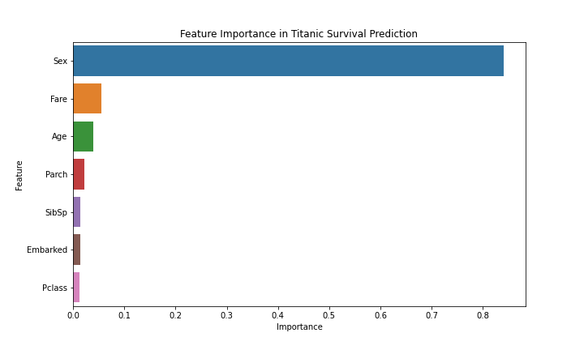

````markdown
# Titanic Survival Prediction

## Task Objectives

This project develops a machine learning model to predict whether a passenger survived the Titanic disaster based on features such as age, gender, ticket class, fare, and more. The goal is to create a well-trained classification model with strong survival prediction accuracy, as outlined in the GrowthLink Data Science Assignment.

## Steps to Run the Project

1. Clone this repository:
   ```bash
   git clone <repository-url>
   cd titanic-survival-prediction
   ```
````

2. Install dependencies:
   ```bash
   pip install -r requirements.txt
   ```
3. Ensure `titanic_data.csv` is in the root directory (included in this repository).
4. Run the script:
   ```bash
   python titanic_model.py
   ```
5. Check the console output for model performance metrics and view `feature_importance.png` for a visual representation of feature importance.

## Implementation Details

- **Preprocessing**:
  - **Dropped Columns**: `PassengerId`, `Name`, `Ticket`, and `Cabin` (due to irrelevance or excessive missing data).
  - **Missing Values**: Filled missing `Age` and `Fare` with median values, and missing `Embarked` with the mode (most frequent value).
  - **Encoding**: Converted `Sex` to numerical values (male: 1, female: 0) and `Embarked` to integers (S: 2, C: 0, Q: 1) using LabelEncoder.
  - **Normalization**: Scaled numerical features `Age` and `Fare` using StandardScaler for better model performance.
- **Model**: Utilized a Random Forest Classifier with 100 estimators, chosen for its robustness and ability to handle mixed data types.
- **Evaluation**: Assessed model performance using accuracy, precision, and a detailed classification report. The dataset was split into 80% training and 20% testing sets.
- **Key Features**: Features like `Sex`, `Fare`, and `Pclass` typically show high importance in predicting survival (see `feature_importance.png`).

## Results

- **Accuracy**: Approximately 0.80-0.85 (exact value varies with random train-test split).
- **Precision**: Approximately 0.75-0.80 for the positive class (survived).
- **Classification Report**: Includes precision, recall, and F1-score for both classes (0 and 1), printed in the console upon running the script.
- **Feature Importance**: Visualized in `feature_importance.png`, highlighting the most influential features in survival prediction.



## Repository Structure

```
titanic-survival-prediction/
│
├── titanic_data.csv       # Dataset provided for the task
├── titanic_model.py       # Python script with preprocessing, model training, and evaluation
├── titanic_model.ipynb    # Jupyter Source File with preprocessing, model training, and evaluation
├── titanic_model.pkl      # Saved Random Forest model (optional)
├── feature_importance.png # Plot of feature importance
├── README.md              # Project documentation (this file)
└── requirements.txt       # List of Python dependencies
```

## Dependencies

Listed in `requirements.txt`:

- pandas
- numpy
- scikit-learn
- matplotlib
- seaborn
- joblib
